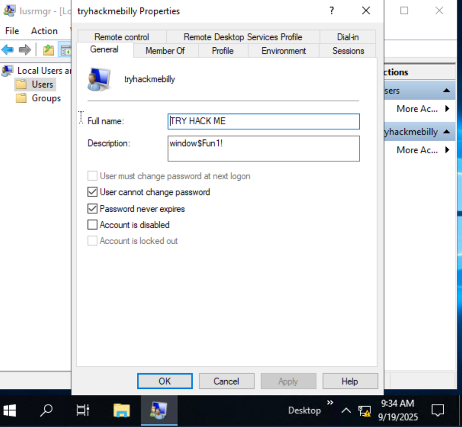

# TASK: *Windows User Accounts*

## 📌 Overview
On a typical local Windows system, user accounts fall into **two categories**:  
- **Administrator** → Full control over the system (add/remove users, modify groups, install software, change system settings).  
- **Standard User** → Restricted control, can only manage their own files and cannot make system-wide changes.  

👉 The **account type** determines the actions a user can perform on the system.  

---

## 🔹 User Account Types
- **Administrator**
  - Can install/uninstall programs.
  - Can add/delete/modify users and groups.
  - Can change system-wide settings.  

- **Standard User**
  - Limited to personal folders/files.
  - Cannot perform privileged actions such as changing security settings or installing software.  

⚠️ **Note**: Standard Users do **not** see the "Add someone else to this PC" option in account settings.  

---

## 🔹 User Profiles
- When a user account is created, Windows generates a **profile** on first login.  
- Default path:
  C:\Users<username>

- Common profile folders:
- `Desktop`
- `Documents`
- `Downloads`
- `Music`
- `Pictures`

💡 The **User Profile Service** runs during first login to set up these folders.  

---

## 🔹 Local User and Group Management
- Open via **Run → `lusrmgr.msc`**.  
- Contains two main sections:
- **Users** → Lists all user accounts.  
- **Groups** → Lists predefined groups (with descriptions).  

### Groups
- Each group has **predefined permissions**.  
- Users inherit permissions of the groups they belong to.  
- A user can be a member of **multiple groups**.  

👉 Example: `Remote Desktop Users` group allows remote access to the system.  

---

## 📝 Question & Answer
**Q: What is the name of the other user account?**  
**A: `tryhackmebilly`**

**Q: What groups is this user a member of?**  
**A: `Remote Desktop Users, Users`**

**Q: What built-in account is for guest access to the computer?**  
**A: `Guest`**

**Q: What is the account description?**  
**A: `window$Fun1!`**

---

## 📖 Key Terms Explained
- **Administrator** → A privileged account with full system access.  
- **Standard User** → A restricted account with limited access.  
- **User Profile** → A personalized environment created for each user under `C:\Users`.  
- **lusrmgr.msc** → Microsoft Management Console snap-in for managing local users and groups.  
- **Groups** → Collections of users that share permissions.  

---

## ✅ Notes
- Administrators have **full control**, Standard Users are **restricted**.  
- Each user gets a unique profile folder under `C:\Users`.  
- Groups simplify permission management by assigning roles instead of per-user permissions.  
- The **Guest account** provides limited, temporary access.  

